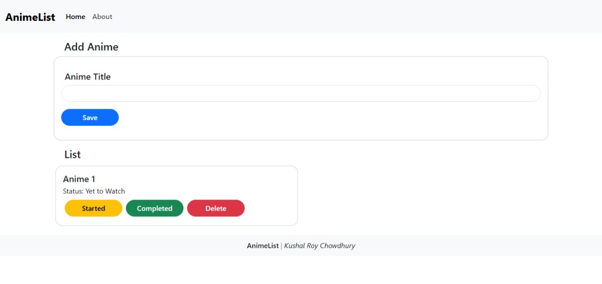

Anime Watchlist app made in React. This is my first React app. It can be used on both desktop and mobiles. And uses Browser Storage to save data locally.
Thank You for using it. The source code is available too.

## Live Demo: *[Click Here](https://watchlistkushal.netlify.app/)*

# Screenshots

### *Homepage with content added.*
---

### *Homepage with no content.*
---
# Tech Stack
- React ⚛️
- Bootstrap 💄
- Local Storage 🗂️
---
# 🙏 Acknowledgements
Thanks for checking out my project!  
Feel free to fork it, star it, or roast me like a burnt potato. 🥔🔥
